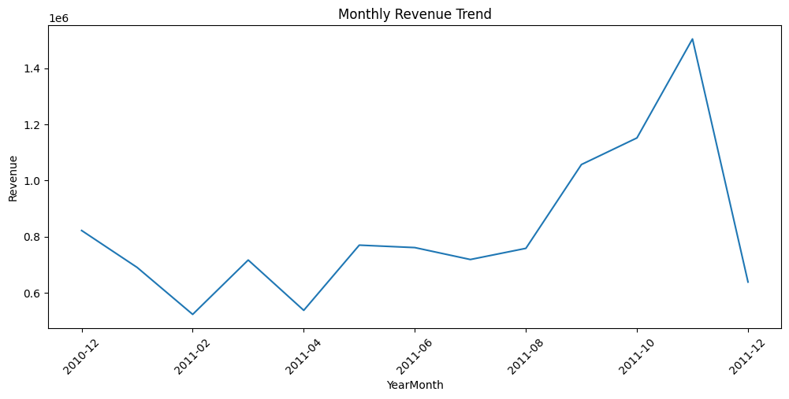
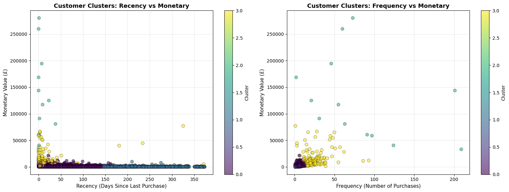
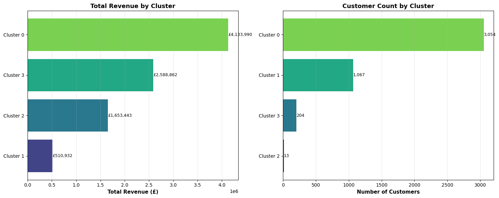

# Online Retail II — Customer Segmentation & EDA

Exploratory data analysis and RFM-based customer segmentation on the UCI Online Retail II dataset (Dec 2010 – Dec 2011).

---

## Dataset

**Source:** [UCI Machine Learning Repository — Online Retail II](https://archive.ics.uci.edu/ml/datasets/Online+Retail+II)

Transactional data from a UK-based online retailer. Key columns: `Invoice`, `StockCode`, `Description`, `Quantity`, `InvoiceDate`, `Price`, `Customer ID`, `Country`.

---

## Project Structure

```
├── customer_segments.xlsx      # Segmentation output
├── python.py                   # EDA script
├── rmmp.ipynb                  # Full analysis notebook
└── README.md
```

> **Note:** `online_retail_II.xlsx` is not included in this repository due to file size. Download it directly from the [UCI Machine Learning Repository](https://archive.ics.uci.edu/dataset/502/online+retail+ii) and place it in the root folder before running the notebook.

---

## Setup

```bash
pip install pandas numpy matplotlib scikit-learn openpyxl
jupyter notebook rmmp.ipynb
```

---

## What This Project Does

1. **Data Cleaning** — removes duplicates, nulls, returns, and invalid entries
2. **Feature Engineering** — derives `TotalSales`, `Month`, `YearMonth`, `DayName`
3. **EDA** — revenue trends, top products, country breakdown, customer behaviour
4. **RFM Scoring** — scores each customer on Recency, Frequency, and Monetary value
5. **K-Means Clustering** — segments customers into distinct groups based on RFM scores

---

## Key Findings

- Revenue peaks sharply in **October–November**, driven by holiday demand, and drops in Dec 2011 as the dataset ends
- Revenue stays relatively flat from Jan–Aug 2011 before a strong Q4 acceleration
- **Cluster 0** is the largest segment (3,054 customers) and generates the highest total revenue (£4.1M) — the core customer base
- **Cluster 2** has only 13 customers but generates £1.65M — a small group of extremely high-value buyers
- The majority of customers have low recency and low monetary value, with a few high-spend outliers clearly visible in the RFM scatter

---

## Visualizations

### Monthly Revenue Trend


Revenue tracked month-over-month from Dec 2010 to Dec 2011. Relatively stable in H1, then a sharp climb through Oct–Nov 2011 peaking at ~£1.5M, followed by a drop in Dec as the period closes.

---

### Elbow Method — Optimal Number of Clusters


Inertia drops steeply from K=2 to K=4, then begins to flatten. K=4 was chosen as the optimal number of clusters — the point where additional clusters stop providing meaningful separation.

---

### Customer Clusters (RFM)


Customers plotted by Recency vs Monetary and Frequency vs Monetary, colour-coded by cluster. Most customers cluster near zero spend and low frequency. A small number of high-monetary outliers (Cluster 2, teal) are clearly separated, representing the highest-value accounts.

---

### Total Revenue & Customer Count by Cluster


Cluster 0 dominates in both headcount (3,054) and total revenue (£4.1M). Cluster 2, despite having only 13 customers, contributes £1.65M — highlighting the outsized impact of a small VIP segment. Cluster 1 has the lowest revenue (£510K) and represents low-engagement or dormant buyers.

---

## Data Source

Chen, D. (2019). Online Retail II. UCI Machine Learning Repository. https://doi.org/10.24432/C5CG6D
